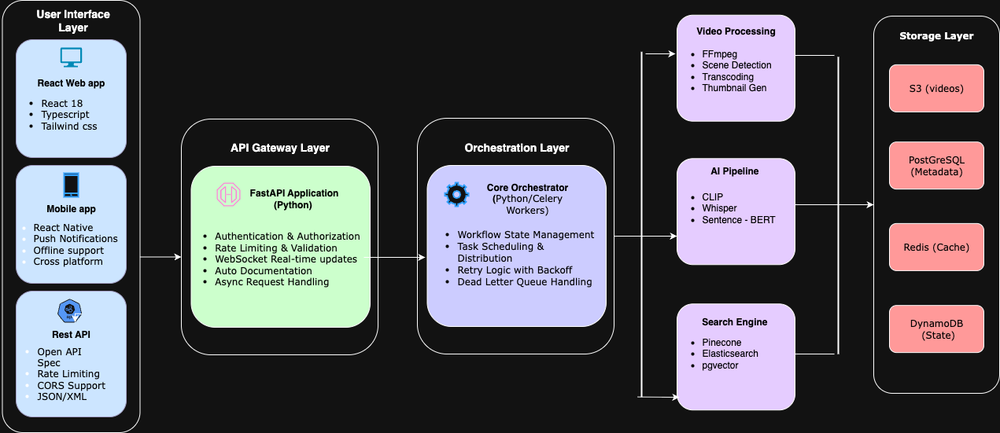

# ClipMind

**AI-Powered Video Memory & Semantic Search Engine**

Transform hours of video footage into an instantly searchable library. Find any moment using natural language queries powered by state-of-the-art AI models.

---

## Table of Contents

- [Overview](#overview)
- [Key Features](#key-features)
- [Technology Stack](#technology-stack)
- [Quick Start](#quick-start)
- [Documentation](#documentation)
- [Project Structure](#project-structure)
- [License](#license)

---

## Overview

ClipMind solves a critical problem for content creators and video teams: finding specific moments in thousands of hours of footage. Instead of manually scrubbing through videos, users can search using natural language like "happy person dancing" or "product demo at sunset" and instantly find relevant clips.

The system combines multiple AI models (OpenAI CLIP, Whisper, Sentence-BERT) with a vector database (Pinecone) to enable truly semantic search across visual and audio content.

**Example Use Cases:**
- Content creators searching through years of raw footage
- Marketing teams finding brand mentions across video archives
- Educators locating specific lecture segments
- Production teams identifying duplicate or reusable B-roll

---

## Key Features

### Semantic Search
Search videos using natural language queries. The system understands context, not just keywords.

### Multi-Modal AI
- **Visual understanding** via OpenAI CLIP (512-dimensional embeddings)
- **Speech-to-text** via Whisper with word-level timestamps
- **Text embeddings** via Sentence-BERT for semantic text search
- **Vector similarity** search via Pinecone for sub-second query responses

### Automatic Processing
- Scene boundary detection using PySceneDetect
- Automatic transcription in 100+ languages
- Smart thumbnail generation at keyframes
- Metadata extraction (duration, resolution, codec)

### Analytics & Tracking
- Search history and query analytics
- Click-through tracking and engagement metrics
- Popular clips identification
- A/B testing capabilities

---

## API Endpoints

### Video Management
- `POST /api/v1/videos/upload` - Upload video file
- `GET /api/v1/videos/{video_id}` - Get video details
- `GET /api/v1/videos/` - List all videos
- `DELETE /api/v1/videos/{video_id}` - Delete video

### Search
- `POST /api/v1/search/` - Search videos using natural language
- `GET /api/v1/search/history` - Get user's search history
- `POST /api/v1/search/track-view` - Track clip view for analytics
- `GET /api/v1/search/analytics/popular-clips` - Get most viewed clips

### Compilations
- `POST /api/v1/compilations/` - Create new compilation
- `GET /api/v1/compilations/{compilation_id}` - Get compilation details
- `GET /api/v1/compilations/` - List all compilations
- `POST /api/v1/compilations/{compilation_id}/render` - Render compilation

### Analytics
- `GET /api/v1/analytics/stats` - Get overall statistics
- `GET /api/v1/analytics/activity` - Get recent activity

**Interactive API Documentation:** http://localhost:8000/docs (when server is running)

---

## Technology Stack

### Core Technologies

| Layer | Technology | Purpose |
|-------|------------|---------|
| **API** | FastAPI (Python 3.11+) | REST API with async support |
| **Task Queue** | Celery + Redis | Distributed video processing |
| **AI Models** | CLIP, Whisper, Sentence-BERT | Visual/audio understanding |
| **Vector DB** | Pinecone | Embedding storage and search |
| **Database** | PostgreSQL 15+ | Metadata and analytics |
| **Storage** | AWS S3 | Video files and thumbnails |
| **State** | DynamoDB | Workflow tracking |
| **Frontend** | React 18 + TypeScript | User interface |

### System Architecture

<p align="center">
  
</p>

### AI Pipeline

```
Video Upload
    ↓
FFmpeg → Extract audio + frames
    ↓
Whisper → Transcribe audio → Sentence-BERT embeddings (384-dim)
    ↓
PySceneDetect → Detect scenes → Extract keyframes
    ↓
CLIP → Generate visual embeddings (512-dim)
    ↓
Pinecone → Index all embeddings
    ↓
Search Query → Generate query embeddings → Vector similarity search → Return results
```

---

## Quick Start

### Prerequisites

- Python 3.11+
- Node.js 18+
- FFmpeg (installed system-wide)
- AWS account (S3, DynamoDB)
- Pinecone account (free tier available)
- Docker (optional, for local development)

### 1. Clone and Setup

```bash
git clone https://github.com/yourusername/clipmind.git
cd clipmind
```

### 2. Backend Setup

```bash
cd backend

# Install dependencies
poetry install

# Configure environment
cp .env.example .env
# Edit .env with your AWS keys, Pinecone API key, etc.

# Create AWS resources
aws s3 mb s3://clipmind-raw
aws s3 mb s3://clipmind-processed
aws s3 mb s3://clipmind-thumbnails

aws dynamodb create-table \
  --table-name clipmind-workflow-state \
  --attribute-definitions AttributeName=workflow_id,AttributeType=S \
  --key-schema AttributeName=workflow_id,KeyType=HASH \
  --billing-mode PAY_PER_REQUEST

# Run database migrations
poetry run alembic upgrade head

# Install AI dependencies
pip install -r requirements_ai.txt
```

### 3. Install FFmpeg

```bash
# macOS
brew install ffmpeg

# Ubuntu/Debian
sudo apt-get install ffmpeg

# Verify installation
ffmpeg -version
```

### 4. Start Services

```bash
# Terminal 1: API Server
cd backend
poetry run uvicorn app.main:app --reload --port 8000

# Terminal 2: Celery Worker
cd backend
poetry run celery -A app.tasks.celery_app worker --loglevel=info

# Terminal 3: Frontend
cd frontend
npm install
npm run dev
```

**Access the application:**
- Frontend: http://localhost:3000
- API: http://localhost:8000
- API Docs: http://localhost:8000/docs

### 5. Upload Your First Video

1. Navigate to http://localhost:3000
2. Click "Upload" and select a video file
3. Wait for processing (monitor Celery logs)
4. Search for clips using natural language

---

## Documentation

Detailed documentation is available in the `docs/` directory:

- **[Architecture](docs/ARCHITECTURE.md)** - System design, components, data flow
- **[API Reference](docs/API.md)** - Complete API documentation with examples
- **[AI Models](docs/AI_MODELS.md)** - Detailed AI model usage and performance
- **[Deployment](docs/DEPLOYMENT.md)** - Production deployment guide
- **[Data Flow](backend/README_DATA_FLOW.md)** - Video processing pipeline
- **[Search Guide](backend/README_SEARCH.md)** - Search implementation details

### Quick Links

- [API Documentation (Interactive)](http://localhost:8000/docs) - When server is running
- [Contributing Guidelines](CONTRIBUTING.md)
- [Code of Conduct](CODE_OF_CONDUCT.md)

---

## Project Structure

```
clipmind/
├── backend/
│   ├── app/
│   │   ├── api/              # API endpoints
│   │   ├── models/           # Database models
│   │   ├── services/         # Business logic
│   │   ├── repositories/     # Data access layer
│   │   ├── ai/               # AI model integrations
│   │   ├── workers/          # Video processing
│   │   ├── storage/          # S3, DynamoDB services
│   │   └── tasks/            # Celery tasks
│   ├── alembic/              # Database migrations
│   ├── tests/                # Test suite
│   └── pyproject.toml        # Python dependencies
├── frontend/
│   ├── src/
│   │   ├── pages/            # React pages
│   │   ├── components/       # Reusable components
│   │   └── App.tsx           # Main app
│   └── package.json          # Node dependencies
├── infrastructure/           # AWS CDK (Infrastructure as Code)
├── docs/                     # Documentation
└── README.md
```

---

## Performance

### Processing Benchmarks

- **Video ingestion** (1080p, 10 min): 45 seconds
- **Scene detection**: 2 minutes
- **Transcription** (Whisper base): 3 minutes
- **Embedding generation**: 1 minute
- **End-to-end processing**: ~7 minutes
- **Concurrent processing**: 50+ videos

### Search Performance

- **Semantic search** (P50): 120ms
- **Semantic search** (P95): 350ms
- **Pinecone query**: <100ms

### Cost Estimate

Monthly cost for 1,000 hours of video:

| Service | Cost |
|---------|------|
| S3 Storage | $23 |
| PostgreSQL RDS | $60 |
| ECS Fargate | $120 |
| Pinecone | $70 |
| Data Transfer | $30 |
| **Total** | **~$303/month** |

---

## Development

### Running Tests

```bash
# Unit tests
pytest tests/unit -v

# Integration tests
pytest tests/integration -v

# With coverage
pytest tests/ --cov=app --cov-report=html

# Load tests
locust -f tests/load/locustfile.py
```

### Code Quality

```bash
# Format code
black app/

# Lint
flake8 app/

# Type checking
mypy app/
```

---

## Contributing

Contributions are welcome! Please follow these steps:

1. Fork the repository
2. Create a feature branch (`git checkout -b feature/amazing-feature`)
3. Write tests for your changes
4. Ensure all tests pass (`pytest`)
5. Commit with clear messages (`git commit -m 'Add amazing feature'`)
6. Push to your branch (`git push origin feature/amazing-feature`)
7. Open a Pull Request

See [CONTRIBUTING.md](CONTRIBUTING.md) for detailed guidelines.

---

## Roadmap

**Phase 1: MVP** (Completed)
- Video upload and processing
- AI-powered search
- Basic analytics

**Phase 2: Enhancement** (Current)
- Smart compilations
- Advanced analytics dashboard
- Multi-user workspaces

**Phase 3: Enterprise** (Planned)
- Mobile applications
- SSO integration
- Custom model fine-tuning
- White-labeling options

---

## License

This project is licensed under the MIT License - see the [LICENSE](LICENSE) file for details.

---

## Author

**Abhishek Kankanala**
- LinkedIn: [linkedin.com/in/abhishek-kankanala](https://linkedin.com/in/abhishek-kankanala)
- GitHub: [@abhikank](https://github.com/abhikank)

---

## Acknowledgments

This project uses the following open-source technologies:

- [OpenAI CLIP](https://github.com/openai/CLIP) - Visual understanding
- [OpenAI Whisper](https://github.com/openai/whisper) - Speech recognition
- [Sentence-Transformers](https://www.sbert.net/) - Text embeddings
- [FastAPI](https://fastapi.tiangolo.com/) - Modern Python web framework
- [FFmpeg](https://ffmpeg.org/) - Video processing

---

## Support

- **Issues**: [GitHub Issues](https://github.com/yourusername/clipmind/issues)
- **Discussions**: [GitHub Discussions](https://github.com/yourusername/clipmind/discussions)
- **Email**: abhikank90@gmail.com

---

**Built for content creators, video production teams, and media organizations**
